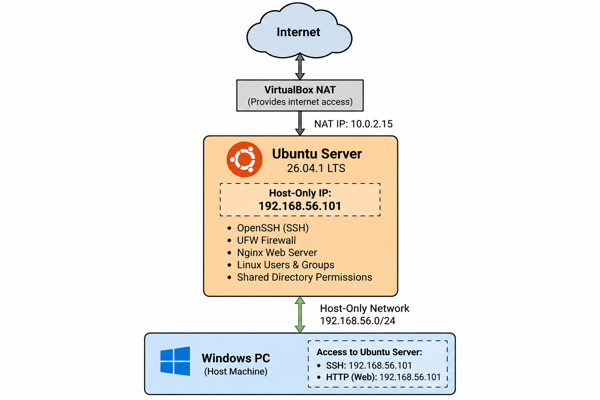
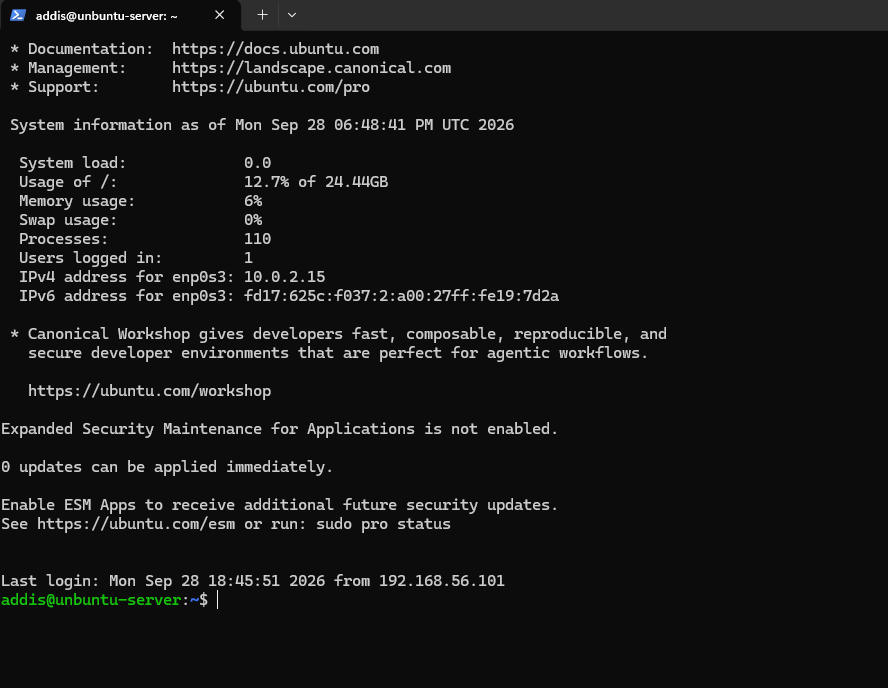
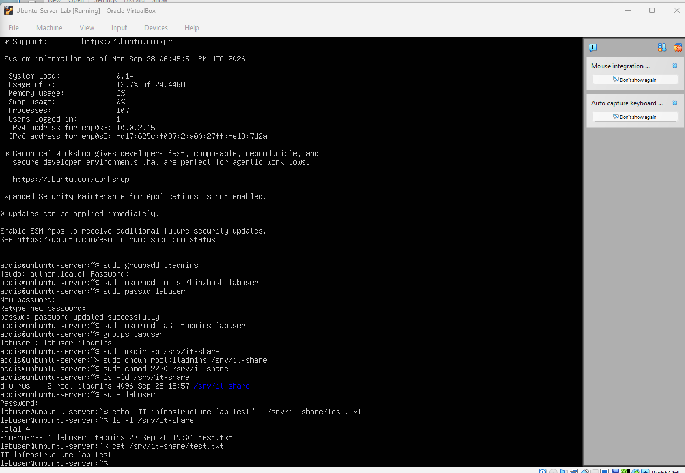
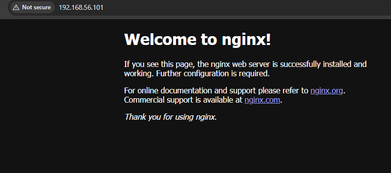
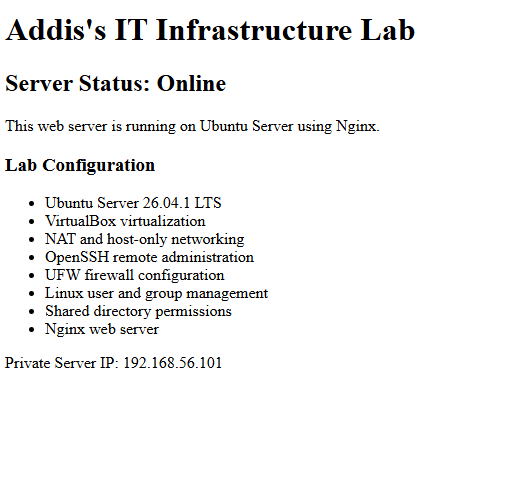

# Home IT Infrastructure Lab

## About This Project

I made this project to learn more about IT infrastructure and working with Linux servers. I used VirtualBox on my Windows PC to create an Ubuntu Server and then set up a private network between my PC and the server.

I started by installing Ubuntu Server and getting the network working. I used NAT so the server could access the internet and a host-only adapter so I could connect to it directly from Windows.

After that, I installed SSH and was able to remotely log into the Ubuntu server through Windows PowerShell. I also set up UFW firewall rules to allow SSH and web traffic.
## Network Diagram

## User Management

I created a second user called `labuser` and a group called `itadmins`. I also made a shared folder at `/srv/it-share` and set permissions so users in the group could access it.

I tested the permissions by logging in as `labuser`, creating a file in the shared folder, and reading the file back.

## Web Server

I installed Nginx on the Ubuntu server and allowed HTTP traffic through the firewall. I tested the web server from my Windows PC by going to `192.168.56.101` in my browser.

After I got it working, I replaced the default Nginx page with my own page showing the different parts of my lab.

## What I Used

- Ubuntu Server 26.04.1 LTS
- VirtualBox
- SSH
- UFW Firewall
- Nginx
- Windows PowerShell
- Linux users, groups, and permissions
- NAT and host-only networking

## What I Learned

Before this project, I had more experience with programming than working with servers. Setting everything up helped me understand how the different parts of a server actually work together.
I ran into a few problems while setting it up. At first SSH wasn't running, so I had to figure out how to start and enable the service. I also had to figure out the difference between NAT and host-only networking before I could connect to the server directly from my Windows PC. I made a few command mistakes along the way too, which helped me get more comfortable troubleshooting Linux.
By the end I was able to connect to the server through SSH, manage users and permissions, configure the firewall, and access the Nginx web server from my Windows PC.

### SSH Connection
I connected to the Ubuntu server remotely from my Windows PC using PowerShell and SSH.

### User and Permissions Test
I logged in as `labuser` and tested access to the shared directory by creating and reading a test file.

### Web Server
I tested the Nginx server from my Windows PC and accessed the custom lab page through the server's private IP address.

After confirming the Nginx server was working, I replaced the default page with my own page showing the configuration of my IT infrastructure lab.

